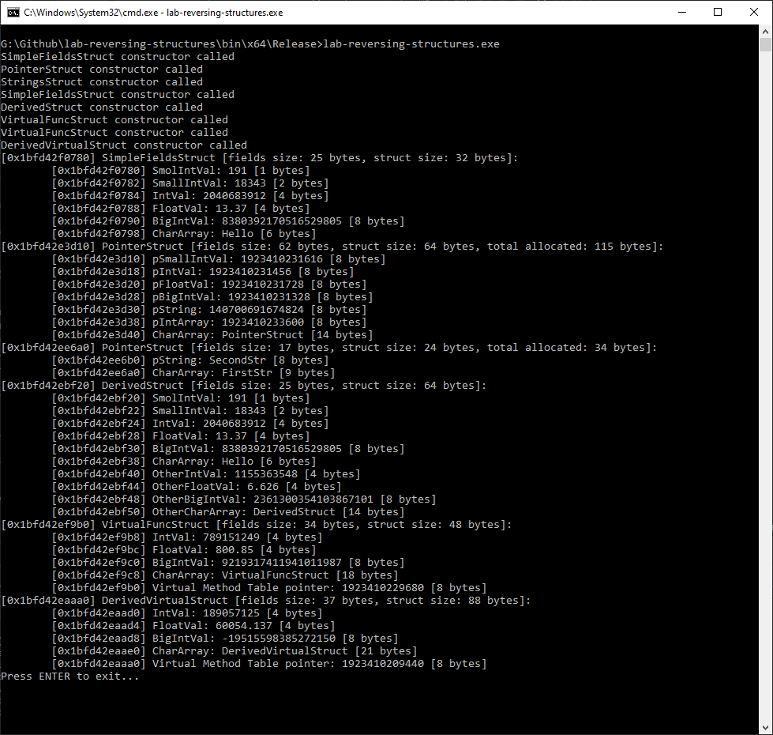
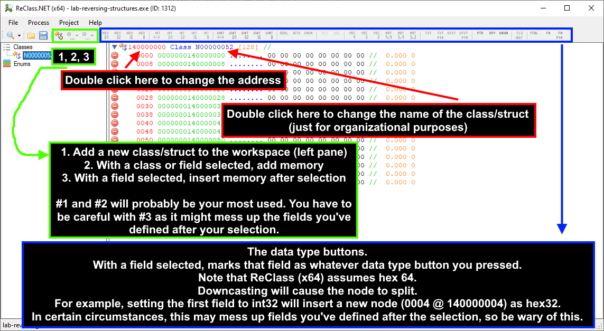
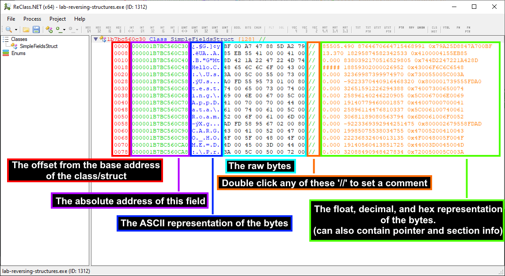
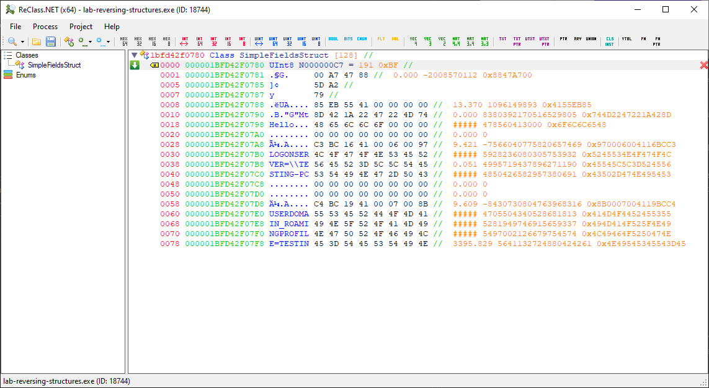
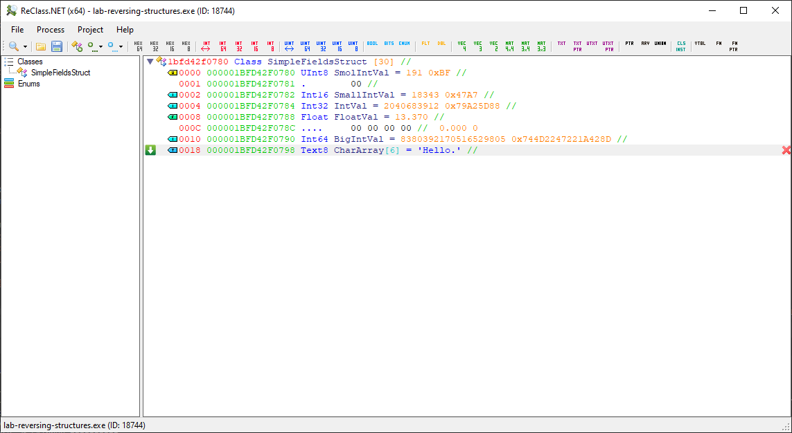

# lab-reversing-structures #
Walkthrough of what various data structures look like in memory.

## Prerequisites ##

1. A memory viewer. [ReClass.NET](https://github.com/ReClassNET/ReClass.NET) is used in the screenshots. If you choose to use ReClass.NET, I recommend compiling from source. Remember to compile both x64 and x86 and run whichever matches the target.
2. Visual Studio, to be able to compile this lab. This guide will be using the x64 build.
3. Knowledge of primitive data types. `unsigned char` = an unsigned integer 1 byte (8 bits) long, `short` = signed integer 2 bytes (16 bits) long, `int` = signed integer 4 bytes (32 bits) long, etc.
4. Familiarity with C++ including arrays, C-style strings, pointers, inheritance, and virtual member functions.

## Objectives ##

1. To understand how data structures may transform between code definition and actual memory layout.
2. To learn how some common language features are implemented in **memory** (strings, inheritance, virtual methods).
3. (bonus) To learn how some common language features are implemented in **code** (object instantiation, inheritance, and virtual method tables)

## Walkthrough ##

Compile and launch the lab. This guide uses the x64 release build.<br>

|  |
|:--:|
| <sub>Image: Running the Lab</sub> | 

Launch ReClass and go to File -> Attach to Process -> select the lab-reversing-structures.exe process.<br>

|  |
|:--:|
| <sub>Image: ReClass, with explanations</sub> | 

|  |
|:--:|
| <sub>Image: ReClass, with more explanations</sub> | 

Start by changing the address to the address of the SimpleFieldsStruct. You can choose to name the struct too if you'd like. This will make keeping track of multiple classes/structs easier. In my example, the SimpleFieldsStruct was allocated at address `0x1bfd42f0780`. ReClass.NET allows the prefix `0x` but I usually remove it.<br>

Now that we're looking at the SimpleFieldsStruct in memory, let's cross-reference it with the code definition so we can start to make sense of it.<br>
I'll be omitting the function definitions since we're only interested in fields.<br>
Functions aren't part of each object instance and so have no bearing on their memory layout.<br>

```cpp
struct SimpleFieldsStruct
{
	unsigned char SmolIntVal = 191;
	short SmallIntVal = 18343;
	int IntVal = 2040683912;
	float FloatVal = 13.37f;
	__int64 BigIntVal = 8380392170516529805;
	const char CharArray[6] = "Hello";
}
```
We can see that the first field should be an unsigned char with a value of 191. An unsigned char is the smallest data type in C/C++ and represents 1 byte (8 bits) and is the same as uint8 (an unsigned integer of 8 bits), so select that in ReClass.

|  |
|:--:|
| <sub>Image: Setting the first field as uint8 (ReClass)</sub> | 

This matches up with the value in the code definition as expected. Great. Now if you're familiar with hex and looking at the raw bytes you might notice trouble brewing.<br>
If you set the next node in ReClass (at offset `0001`) to int16 as per the code definition, you'll end up with -22784 which definitely doesn't match.<br>
The reason for this is very important: compilers will add padding bytes to make sure fields align on boundaries of 4 bytes or 8 bytes (depending on x86 or x64), or a multiple of the size of the type, whichever is smallest. This helps with CPU caching as well as machine code generation for things like array accesses.<br>
In this example, the next field is of type `short` which is a signed 2-byte integer so the compiler will try to align it to the nearest multiple of 2. In this case, that means that a pad byte is placed at offset `0001` and our field `short SmallIntVal` starts at offset `0002`.<br>
In ReClass, we can select `0001` and set it to hex8 to be able to see the `0002` offset, which we can then set to int16 as per the code definition.<br>

|  |
|:--:|
| <sub>Image: Ignoring the pad byte and setting the second field as int16 (ReClass)</sub> | 

We can see it matches the value given in the code definition now.<br>
Now that we know about pad bytes, let's see if we can fill out the rest of the struct in ReClass.<br>
We know that the next field is an `int` (4 bytes (32 bits)) and the next absolute address is `000001BFD42F0784` which is already a multiple of 4, so we shouldn't expect any padding to be necessary. Setting it to int32 in ReClass confirms this as we get a value of `2040683912` which matches the code definition.<br>
The fourth field in the code definition is a float (4 bytes (32 bits)) and the next absolute address is `000001BFD42F0788` which, again, is a multiple of 4 so we can go ahead and set that to FLT in ReClass and see our value of `13.37`.<br>
This brings us to the fifth field. In the code definition, we see it's an __int64 (8 bytes, 64 bits) and the next absolute address is `000001BFD42F078C`. `8C` is not a multiple of 8, so we already know there will be padding bytes, but how many? The nearest multiple of 8 from `8C` is `90` which is 4 bytes away so now we know there will be 4 padding bytes. We can set offset `000C` to hex32 to represent these 4 bytes and allow us to select offset `0010` and set it to int64 to see our value of `8380392170516529805` which matches the code definition.<br>
Finally, all that's left is an array of `char`s (1 byte, 8 bits) that when viewed as an ASCII string will read "Hello". In ReClass, we could either declare an array of int8 by pressing the ARY button then setting the member size to 1 and number of elements to 6 as per the code definition, but that ignores the fact that this is an ASCII string. So instead, we can just press the TXT button and set the number of elements to 6. Now you may notice that the word "Hello" contains 5 characters, but the minimum array size (in code) to hold such a string is 6. This is because it's a C-style string that's null-terminated (the last byte is `00` to signify the end of the string).<br>
And now we have fully mapped out the SimpleFieldsStruct! I went ahead and renamed the fields to match their code counterparts by double-clicking the auto-generated names. I also removed the excess bytes that don't belong to our struct by clicking offset `001E` and then shift clicking the last offset in the viewer `007E` then pressing the delete key on my keyboard. Doing this doesn't modify the bytes in memory, it only changes how much ReClass looks at.

|  |
|:--:|
| <sub>Image: Fully mapped out our SimpleFieldsStruct (ReClass)</sub> | 

The last thing to note is that the struct itself is subject to the alignment rules mentioned before. The end of the data fields is at address `1BFD42F079E` which gives us a total size of 30 bytes (`1BFD42F079E` - `1bfd42f0780` = `1E` or 30 in decimal), so the compiler will add 2 padding bytes to bring its total size to 32 which is a multiple of 8. This is important to keep in mind when dealing with arrays of structs. So in that case you'd want to add those 2 padding bytes back in ReClass (add 4, then set to hex16 and right click -> remove node on the last node).

## On Your Own ##

Now that we've covered SimpleFieldsStruct, try to go through the rest of the structs and see if you can map them out in ReClass by yourself. Were you surprised by the in-memory layout not matching with your expectations given its code definition? Have you gained a better understanding of what pointers are and how they work? Did you get stuck on the struct containing virtual member functions? Hint: the first field is auto-generated by the compiler and it points to an array.


## Bonus: data structures from code perspective ##

TO-DO